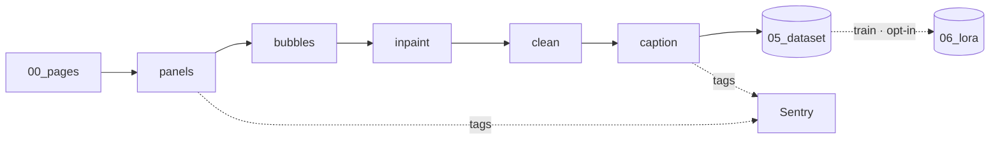

# System overview

`make-style-dataset` turns a pile of comic pages into a
[kohya_ss](https://github.com/bmaltais/kohya_ss)-ready dataset for training a
**style** LoRA. It is a linear, file-driven pipeline: each stage reads one
folder under the workspace and writes the next.

## Pipeline stages

The pipeline has an input drop plus six transforms, one per CLI subcommand:

0. **pages** *(input)* — raw pages land in `00_pages/`.
1. **panels** — detect comic panels and slice pages into individual panels (Kumiko + OpenCV).
2. **bubbles** — detect speech bubbles and emit removal masks.
3. **inpaint** — paint the masked bubbles out of each panel.
4. **clean** — drop near-duplicates (perceptual hash) and too-small panels.
5. **caption** — caption survivors and lay out `05_dataset/<N>_<trigger>/`.
6. **train** *(opt-in)* — train a style LoRA from the dataset into `06_lora/` by
   shelling out to a local [kohya sd-scripts](https://github.com/kohya-ss/sd-scripts)
   venv (SD 1.5 / SDXL / Flux).

`run-all` executes stages 1–5 in order; each stage is idempotent (see
[Workspace contract](WORKSPACE.md)). **Stage 6 (`train`) is off by default**
(`APP_RUN_TRAIN=false`): it is heavy and needs a GPU + a base checkpoint, so it
is run explicitly with `make-style-dataset train` or the app's *Train* step.

## Components

- **cli** — thin argparse shell (`make-style-dataset <stage>` / `run-all`).
- **pipeline** — ordered stage registry + idempotent runner.
- **stages** — one module per transform; metadata + a `run(ctx)` function.
- **workspace** — typed, single-root directory contract.
- **config** — typed settings (paths, trigger token, thresholds, stage flags);
  the only place that reads the environment.
- **observability** — Sentry init (`send_default_pii=False`) + per-stage
  component tags (`stage:panels`, `stage:bubbles`, …, `stage:train`).
- **stages/train** — pure kohya `dataset.toml` + argv builders and an stdout
  progress parser, behind a `Trainer` protocol; the `SdScriptsTrainer` adapter
  spawns a *separate* (root-owned) trainer venv, never imported into this package.

## Data flow

See the [Workspace layout contract](WORKSPACE.md) for the full folder map.
