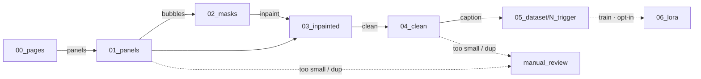

# Workspace layout contract

The pipeline is a sequence of stages that read and write image folders under a
single **workspace root** (configured by `APP_WORKSPACE`, default `workspace/`).
Every path is derived from that root by
[`make_style_dataset.workspace.Workspace`](../../src/make_style_dataset/workspace.py),
so the whole pipeline can be relocated or sandboxed by changing one setting.

## Directory map

| Folder | Owner stage | Contents |
|--------|-------------|----------|
| `00_pages/` | *(input)* | Raw comic pages dropped in by hand or an upstream job. |
| `01_panels/` | `panels` | Individual panels sliced from each page. |
| `02_masks/` | `bubbles` | Binary speech-bubble masks per panel (white = remove). |
| `03_inpainted/` | `inpaint` | Panels with bubbles inpainted away. |
| `04_clean/` | `clean` | Deduplicated, size-filtered panels. |
| `05_dataset/<N>_<trigger>/` | `caption` | kohya-ready images + `.txt` caption sidecars. |
| `06_lora/` | `train` | Trained style-LoRA weights (`.safetensors`) + the generated `dataset.toml`. Opt-in — off in `run-all`. |
| `manual_review/` | *(any stage)* | Artifacts kicked out for a human to inspect. |

`<N>` is `APP_DATASET_REPEATS` and `<trigger>` is `APP_TRIGGER_TOKEN`, so the
caption stage writes to e.g. `05_dataset/10_comicstyle/` — the folder-name
convention [kohya_ss](https://github.com/bmaltais/kohya_ss) uses to encode the
per-image repeat count for LoRA training.

## Data flow

The `train` stage (stage 6) is **off by default** (`APP_RUN_TRAIN=false`), so
`run-all` stops at `05_dataset/`. It is run explicitly — `make-style-dataset
train` or the app's *Train* step — and shells out to a separate
[kohya sd-scripts](https://github.com/kohya-ss/sd-scripts) venv (see the
[User guide](../USER_GUIDE.md#training-a-lora-optional)).

## Idempotency

Each stage writes a `.stage_complete` marker into its output folder on success
and is **skipped on re-runs** unless `--force` is passed (see
[`pipeline.run_stage`](../../src/make_style_dataset/pipeline.py)). This makes
re-running a partially-finished pipeline safe and cheap. Stage enable flags
(`APP_RUN_*`) gate which stages `run-all` executes; an explicit single-stage
invocation always runs regardless of its flag.
